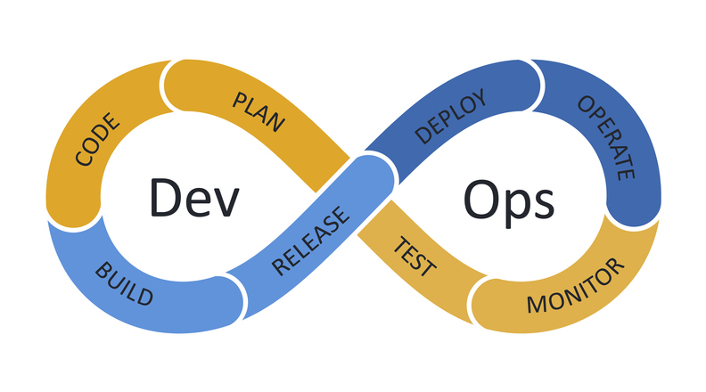

# **DevOps**

# 1. What is DevOps?

DevOps is a set of practices that combine software development (Dev) and IT operations (Ops) to shorten the development lifecycle and deliver high-quality software continuously. The goal of DevOps is to automate and integrate the processes between software development and IT teams, allowing them to build, test, and release software faster and more reliably.

## Traditional Scenario

\- **Developers:** write the code and push it to a repository (e.g., GitHub).
\- **Operations teams:** manage the servers and infrastructure.
**⇒** Often, there are conflicts when the code works on the developer\'s machine but not in the server environment.

## Challenges in the Application Release Process

### **Miscommunication and Lack of Collaboration**

\- Developers and operations teams often work in silos, leading to delays and errors.

\- Developers may not consider deployment environments, while operations teams may not understand the code thoroughly.

### **Different Incentives**

\- Developers aim to release new features quickly.

\- Operations focus on maintaining stability and preventing disruptions.

### **Security and Testing Roadblocks**

\- Manual security evaluations and testing processes can significantly delay releases.

\- Manual Processes

\- Manual deployments and infrastructure configurations are slow and error-prone.

## DevOps Solution

DevOps engineers bridge the gap between development and operations by automating the software development lifecycle (SDLC), ensuring seamless and efficient collaboration between the two teams.

## Why DevOps is Needed

DevOps addresses key challenges in the traditional software development and release process, such as:

\- Miscommunication between development and operations teams

\- Slow-release cycles

\- Manual and error-prone processes

\- Lack of automation

## Evolution and Role of DevOps Engineer

### **Evolution**

\- Initially, DevOps was about fostering better communication and collaboration between development and operations.

\- Over time, it evolved into a specialized role known as a DevOps Engineer.

### **Role of DevOps Engineer**

\- Automate the release process

\- Manage CI/CD pipelines

\- Prepare and configure infrastructure

\- Ensure continuous testing and monitoring

\- Collaborate with development, operations, and security teams

# 2. The DevOps Lifecycle

The DevOps Lifecycle is a series of stages that help in developing, deploying, and maintaining software applications efficiently:

## Planning

In this stage, the team defines the project\'s goals and requirements.
They discuss what needs to be built, the timeline, and the resources required. Planning ensures everyone understands the objectives and how to achieve them.

## Development

During development, programmers write the code for the application. They use different programming languages and tools to create the features planned. This stage often involves:

\- Writing code

\- Reviewing code to ensure quality

\- Collaborating with team members

## Continuous Integration (CI)

Continuous Integration means regularly merging all developers\' code changes into a shared repository. This helps find and fix problems early. Tools automatically build and test the new code to ensure it integrates well with the existing codebase.

## Continuous Testing

Testing is crucial to ensure the software works correctly. Continuous Testing involves running automated tests to check for bugs or issues.
These tests happen frequently, usually every time new code is integrated. It helps catch problems early, making them easier to fix.

## Continuous Deployment (CD)

Continuous Deployment means automatically deploying the tested code to production, where users can access it. This stage ensures that new features or fixes reach users quickly. It involves:

\- Automating the release process

\- Ensuring the new code doesn\'t disrupt the existing system

## Monitoring and Logging

After deployment, the software needs to be monitored to ensure it runs smoothly. Monitoring tools check the application's performance, such as response times and error rates. Logging involves recording system activities to help diagnose issues when they occur.

## Feedback and Optimization

Feedback is gathered from users and monitoring tools to understand how the application performs and meets user needs. This feedback helps identify areas for improvement. The team uses this information to optimize the software, making it better and more efficient.

## Continuous Improvement

DevOps is an ongoing process. Continuous Improvement involves regularly reviewing all stages of the lifecycle to find ways to enhance the process. It means learning from experiences and making adjustments to improve speed, quality, and reliability.

# 3. Pathways to Becoming a DevOps Engineer

To become a DevOps engineer, you need to acquire a diverse set of skills that cover both development and operations.

## Git for Version Control:

Version control, using Git, is important for tracking code changes, collaborating with teams, ensuring a reliable history of software development, and facilitating essential DevOps practices such as CI/CD, GitOps, and storing Infrastructure as Code (IaC) files.

### **What should you know:**

\- Branching

\- Git Commands

\- Pull/Merge Requests

\- GitHub/GitLab

## Operating System (Linux):

As a DevOps engineer, you manage the servers where applications run. Linux is the go-to choice for servers, and Most DevOps tools are Linux-based; so knowing Linux commands helps a lot in server management and handling DevOps Tasks.

### **What should you know?**

\- Shell Commands SSH for remote access

\- Virtualization

\- Text Editors for File Editing (vim, nano)

\- File System Permissions Package Management (apt, yum)

\- Process and Service Management (ps, kill)

## Scripting/Programming:

DevOps Engineers automate tasks to streamline software delivery and
enhance efficiency. Scripting is typically carried out using OS-based
languages such as BASH and Powershell, or standalone languages like
Python or Golang.

### **How is scripting used in DevOps?**

\- Backup Automation

\- Working with APIs

\- Integration with other DevOps tools

\- System Cleanup Automation

\- Email Notification Script

\- Software Update Automation

\- Log Analysis Automation

\- Network Diagnostics Script

\- Data Transformation Automation

{width="2.602156605424322in"
height="0.9781835083114611in"}

## Networking & Security

With the rise in DevSecOps, incorporating security practices into the
entire development lifecycle is vital. This ensures proactive
identification and early addressing of security concerns. Having solid
networking knowledge is crucial for securing systems, enabling the
configuration of firewalls and implementation of essential network
security measures.

### **What should you know?**

\- IP Addressing

\- Ports and Protocols (TCP/IP, UDP, HTTP, DNS)

\- Network Services (DHCP, DNS)

\- Routing and Switching Basics

\- Authentication and Authorization

\- Security Best Practices

\- Shift-Left Security

\- Firewalls and Network Security

## Learn any one Cloud

Companies now prefer deploying applications on cloud providers like AWS,
Azure, or GCP instead of on-premise. This shift enables organizations to
take advantage of the scalability, flexibility, and cost efficiency
provided by cloud services.

### **Tip!**

\- AWS is the most popular cloud provider.

\- Once you master and get certified in any one cloud, it's easy to
learn the others.

### **What should you know?**

\- VPC (Virtual Private Cloud): Create isolated networks.

\- EC2 (Elastic Compute Cloud): Manage virtual servers.

\- S3 (Simple Storage Service): Scalable object storage.

\- RDS (Relational Database Service): Managed databases.

\- IAM (Identity and Access Management): Secure access control.

\- Lambda: Serverless code execution.

\- Route 53: Scalable DNS service.

\- CloudWatch: Monitoring and observability.

\- EKS (Elastic Kubernetes Service): Managed Kubernetes service for
container orchestration

{width="5.872991032370954in"
height="1.17459864391951in"}

## Infrastructure as Code

Utilize the concept of Infrastructure as Code (IaC) to automate the
laborious and error-prone manual processes involved in creating and
configuring infrastructure.

{width="4.966739938757655in"
height="2.0197462817147858in"}

With IaC, we employ coding techniques to establish and configure
infrastructure, facilitated by two main types of tools:

### **1. Infrastructure Provisioning:**

This involves programmatically generating virtualized resources, such as
cloud servers, using tools like Terraform to define and deploy
infrastructure.

{width="2.685489938757655in"
height="0.7622058180227471in"}

### **2. Configuration Management:**

This ensures the continuity of consistent configurations for virtualized
resources over time, all managed through code. For instance, Ansible
playbooks are used to define and enforce server configurations.

{width="1.319225721784777in"
height="1.319225721784777in"}

### **Benefits of having everything in code**

\- Ensures consistency across different environments (e.g., stage, dev,
prod).

\- Can be stored, version-controlled, and collaborated on.

\- Reduces the likelihood of issues or configuration errors.

\- Saves time by eliminating the need to repeatedly create and
configure.

## Microservices and Containerization

Microservices are the new way to deploy applications independently for
better scaling and management, and they are packaged in a container.

### **Container**

\- A packaged application with its dependencies, isolated for easy
deployment, and capable of running consistently on any machine.

\- Docker is the most popular container technology.

### **What should you know?**

\- Microservices and Containerization concepts

\- How to write docker files (Containerize the application)

\- Docker Commands (build, run, exec, ps )

\- How to push and pull docker images in DockerHub

{width="2.3938232720909887in"
height="0.7089720034995626in"}

## Container Orchestration (Kubernetes)

When using microservices an application can have hundreds or thousands
of containers on multiple servers. Managing, scaling and other
operations for these containers require container orchestration tools
like Kubernetes.

### **What should you know?**

\- What is Kubernetes and How it works

\- Cluster creation and administration

\- Deploying application K8s cluster

\- Kubernetes Commands

{width="1.8521576990376203in"
height="1.0458300524934383in"}

## CICD Pipelines

CICD is really important to know!!! Because every company deploys
software in an automated fashion using CICD.

{width="7.083333333333333in"
height="2.0500470253718284in"}

CI/CD Pipeline ensures that each code change, whether introducing new
features or fixing bugs, seamlessly integrates into the existing
application and deploys continuously and automatically for end-users.
This automation streamlines development processes, promotes consistency,
and speeds up the delivery of software innovations.

### **What should you know?**

\- Writing Pipeline scripts

\- Integrating Tests

\- Trigger build

### **Popular tools**

Jenkins is widely used for automating the build and deployment
processes.

{width="1.8921423884514437in"
height="1.3965813648293963in"}

## Monitoring and Logging

\- Continuous monitoring post-release is essential for tracking
performance and detecting issues promptly.

\- DevOps monitoring facilitates early issue identification, leading to
improved performance, reliability, and proactive maintenance.

\- It encompasses monitoring software, infrastructure, and user
experience, fostering a resilient and ever-evolving software delivery
process.

\- Logging records system events for troubleshooting and performance
analysis, aiding in issue diagnosis, ensuring reliability, and informing
data-driven decisions in software delivery.

### **Popular tools**

Grafana

{width="2.1770833333333335in"
height="0.9528652668416447in"}

## Agile Development:

Understanding Agile methodologies and practices.
