# Agile

---

## 1. Why Agile?

Traditional, waterfall-style development often leads to projects bogged down by lengthy planning phases and rigid deadlines. Agile throws this out the window, focusing on iterative development and continuous feedback.

## 2. The Agile Workflow

### 2.1 User Stories & Backlog

The project begins with defining user stories – descriptions of features from the user's perspective. These stories are then prioritized and placed in a backlog, a list of tasks to be completed.

### 2.2 Sprints & Planning

The work is divided into short, time-boxed periods called sprints (usually 1-4 weeks). At the beginning of each sprint, the team selects a set of user stories from the backlog to focus on.

### 2.3 Daily Stand-ups

Short, daily meetings (often standing to keep them brief!) ensure everyone is on the same page, highlighting progress, roadblocks, and dependencies.

### 2.4 Development & Testing

The development team works collaboratively to complete the user stories committed to in the sprint. Testing is integrated throughout the process.

### 2.5 Sprint Review & Retrospective

At the end of the sprint, a review meeting showcases the completed work to stakeholders and gathers feedback. A retrospective meeting follows, allowing the team to reflect on the sprint, identify areas for improvement, and adapt for the next iteration.

## 3. Agile Development Methods

Agile development methods are a collection of frameworks and practices that prioritize flexibility, collaboration, and rapid delivery of software. Unlike traditional, waterfall-style development, Agile methodologies break down projects into smaller, more manageable pieces and emphasize continuous learning and adaptation throughout the development process.

### 3.1 Kanban

A visual method that uses boards to track the progress of tasks through different stages (e.g., To Do, In Progress, Done). Kanban boards are known for their simplicity and flexibility, allowing teams to visualize their workflow and easily manage work in progress.

### 3.2 Lean Software Development

An approach that focuses on eliminating waste and maximizing value in the development process. Lean principles like just-in-time development and continuous improvement are often incorporated into Agile methodologies.

### 3.3 Extreme Programming (XP)

A set of practices that emphasize close collaboration, continuous testing, and rapid feedback. XP practices include pair programming, test-driven development, and short-release cycles.

### 3.4 Crystal

A family of Agile methodologies that emphasizes lightweight processes and adaptation based on project needs. There are different Crystal methodologies (e.g., Crystal Clear, Crystal Serenity) suited for projects of varying sizes and complexities.

### 3.5 Scrum

#### 3.1.1 What is Scrum?

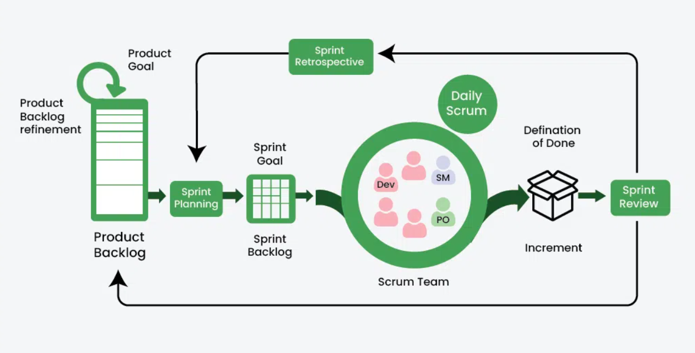

- Scrum is a popular framework that is used whenever we want to develop complex products.
- Scrum allows us to develop products of the highest value while making sure that we maintain creativity and productivity.
- The iterative and incremental approach used in scrum allows the teams to adapt to the changing requirements.

#### 3.1.2 Key Terminologies of Scrum

- **Product Backlog:** The prioritized list of fixes as well as features that is included in the product’s roadmap.
- **Sprint:** The time-box event which typically lasts from one week to four weeks, in this phase a product increment or iteration occurs.
- **Development Team:** Group of individuals who are professional in their field and are responsible for product delivery.
- **Daily Scrum:** A 15 minute daily meeting used by the development team to integrate activities and to create a plan for the next 24 hours of development.
- **Sprint Review:** The sprint review is held at the end of the sprint in which the team presents all the work that is completed to their stakeholders and the stakeholders give back their feedback.
- **Sprint Retrospective:** The sprint retrospective is a meeting concluded at the end of each sprint so that the team can discuss what went well and what could be improved as well as how to make those improvements.

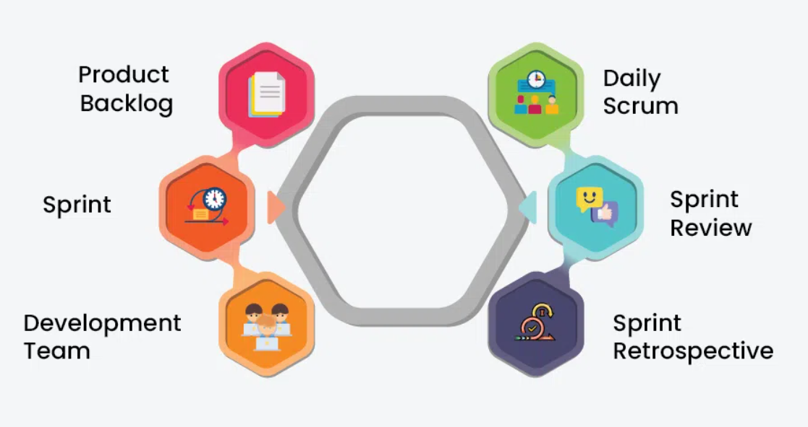

#### 3.1.3 How does Scrum Work?

Scrum divides projects into smaller, more manageable units called **sprints**, which span two to **four weeks** on average. During these sprints, cross-functional teams work together to generate product increments that might potentially be shipped. It uses tools like the **product backlog** and **sprint backlog**, as well as regular events like sprint planning, daily stand-ups, sprint reviews, and retrospectives, to promote transparency, inspection, and adaptation. In the end, this helps teams respond rapidly to changes and produce value iteratively.

#### 3.1.4 What are Scrum Artifacts?

- **Sprint Backlog:** The list of everything which the team commits to achieve in a sprint is known as Sprint Backlog. If it is developed once nobody can add to the sprint backlog except the development team.
- **Product Backlog:** The ordered list of every single thing which is needed in the product based on the product goal is known as product backlog. It is never complete, and it is always evolving.
- **Product Increments:** Lastly at the end of each sprint the development team delivers a product increment which is potentially releasable.

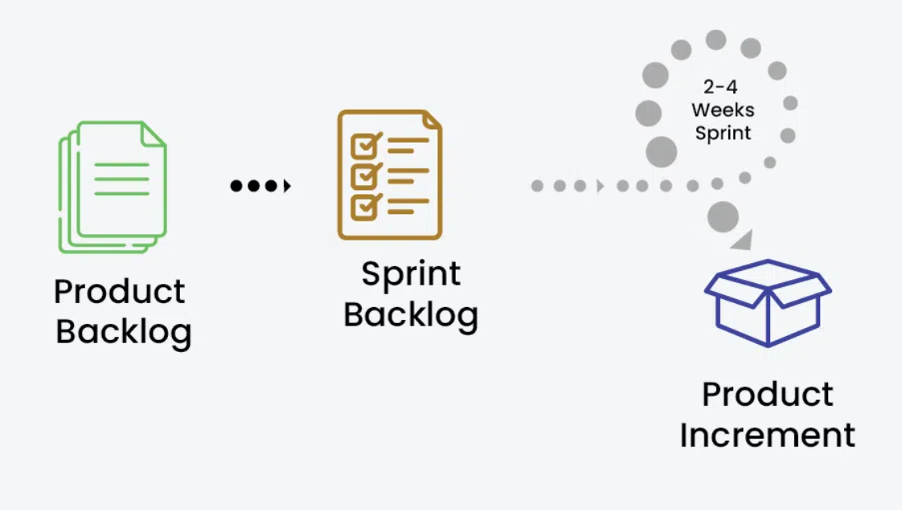

#### 3.1.5 What are Scrum Roles?

- **Scrum Team:** Scrum team is a collection of individuals from the company (typically 6-10 people) who make sure to deliver the project requirements or increments.
- **Product Owner:** The project owner represents the stakeholders and they are the ones responsible for prioritizing the backlog which ultimately leads to maximum value and team work.
- **Scrum Master:** The scrum master is an important individual who serves as a guide and mentor to make sure their team understands the scrum framework and it’s values. the scrum master is highly involved dealing with day to day tasks with their team members.

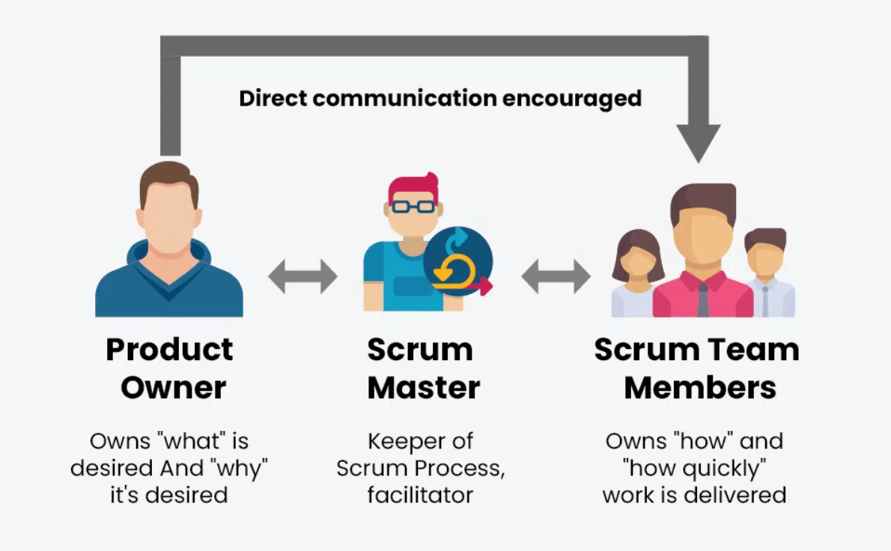

#### 3.1.6 What is scrum cycle?

- **Step 1:** The scrum cycle is a complete cycle of product development which starts with the Product Owner, the product owner defines all the product backlog and requirements for further development.

- **Step 2:** The next step is handled by the scrum team and the scrum team manages the Sprint Planning in the sprint planning phase the team plans all the tasks and roles for the development of the product.

- **Step 3:** Then in the next phase the team deals with the sprint backlogs which are due and deals accordingly with all the backlogs left.

- **Step 4:** As we know the scrum master is someone who overseas all the tasks of the team and acts as a mentor for the team, so in this step the scrum master overseas and collaborates with the team to make sure the product is ready on time, this cycle typically lasts from 1 to 4 weeks but depending on the project size it varies a lot, which is why sometimes for larger projects, it’s also divided into smaller part known as Daily Scrum.

- **Step 5:** This is the final process stage, in this stage the team integrates all the modules of the project and tests the various components of the product.

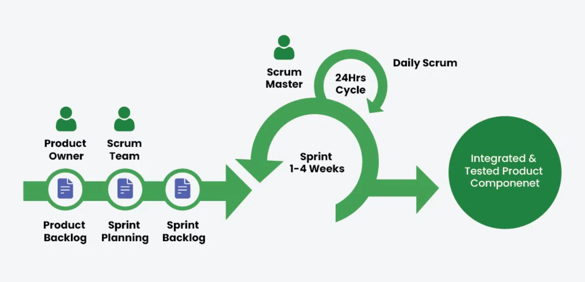

#### 3.1.7 What are Scrum metrics?

- **Velocity**

Velocity is a key Scrum metric that measures the amount of work a team can deliver during a sprint.

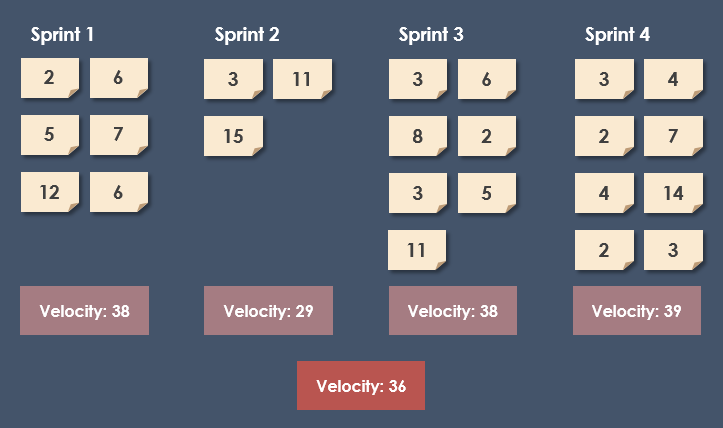

- **Velocity Chart**

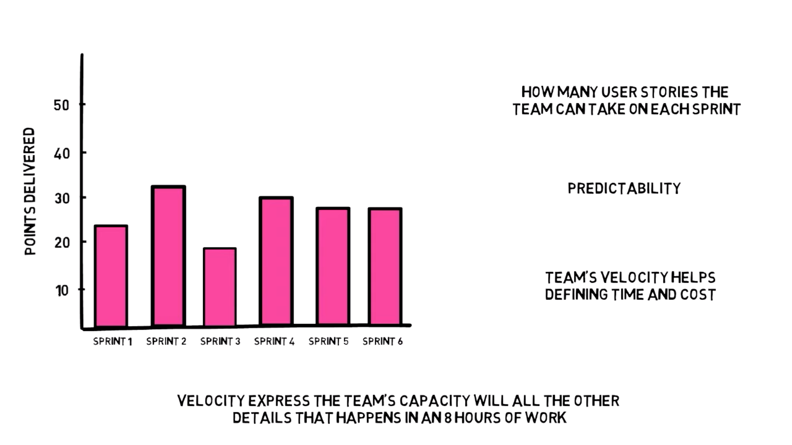
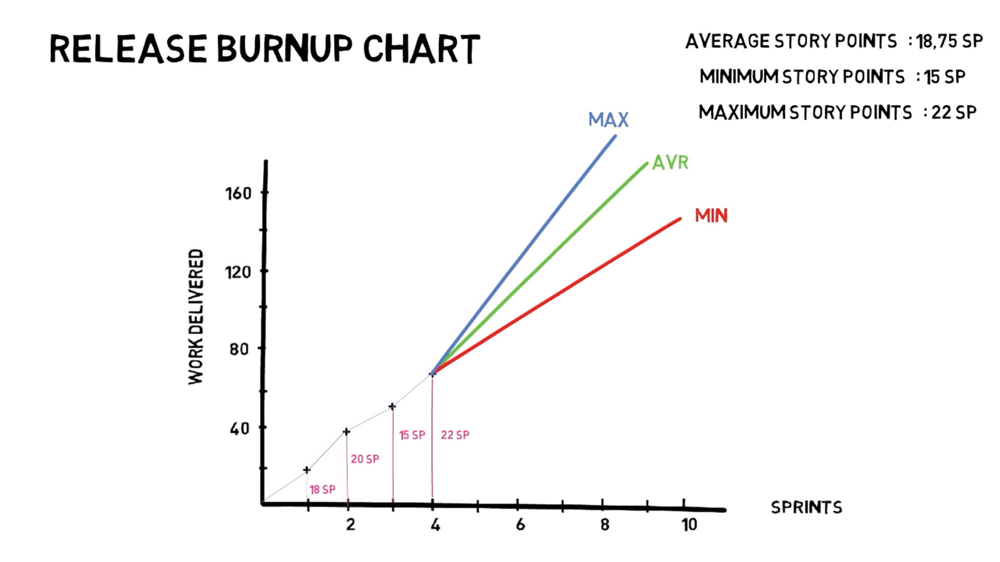
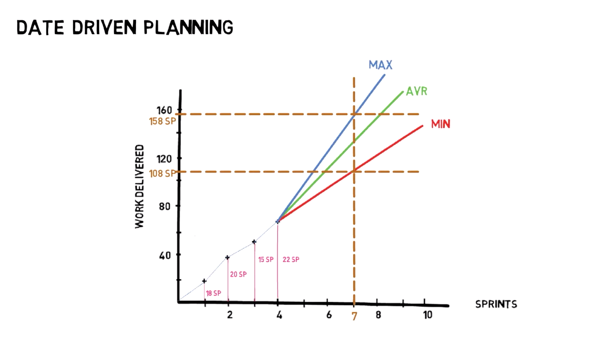
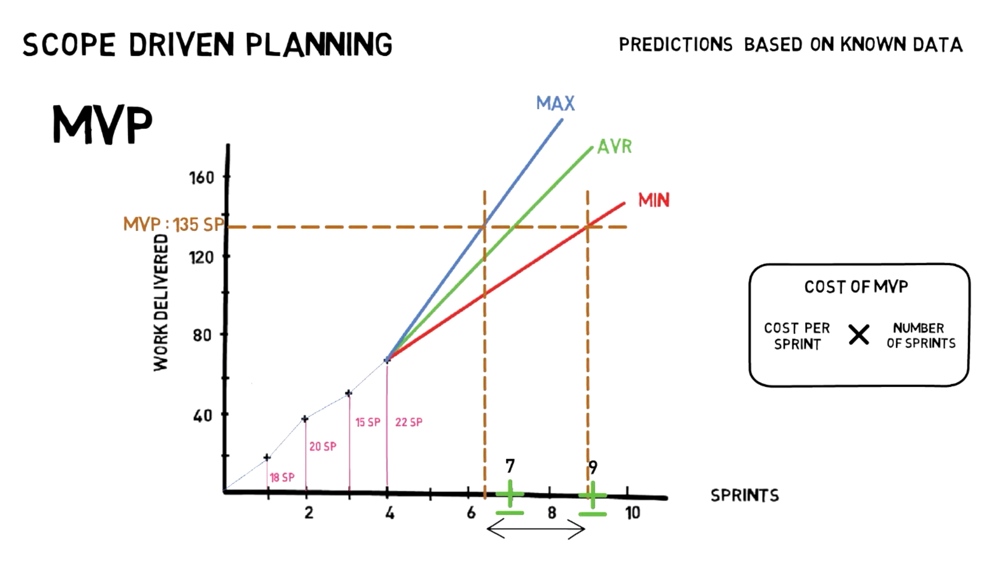

- **Team Capacity**
  When estimating Sprint capacity, forecasting the team members holiday plans,meetings and working hrs commitments per sprint is very valuable

  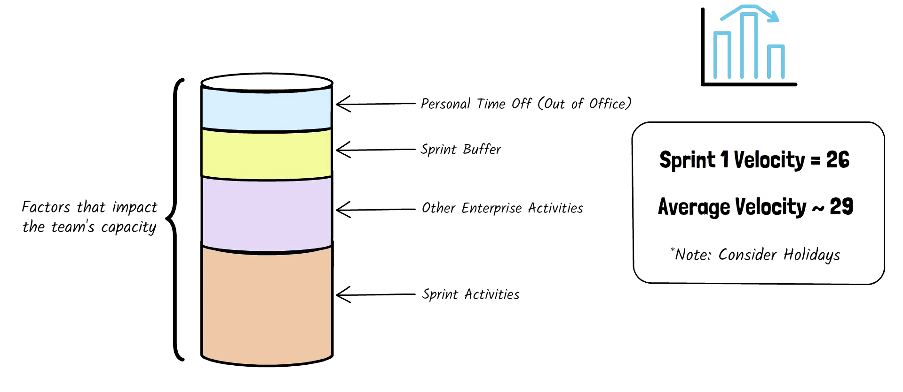

- **Sprint Burn-down**

Sprint burn-down helps teams measure the work remaining during the sprint's execution. It is a visual representation, usually a line chart over time, that shows the rate at which the team completes work compared to how much work is still needed.

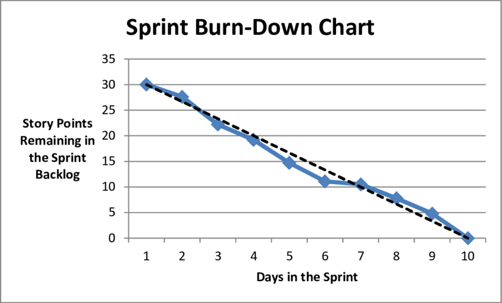
