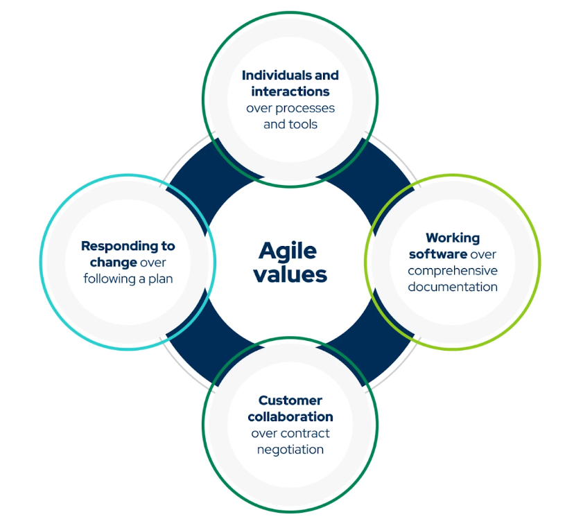
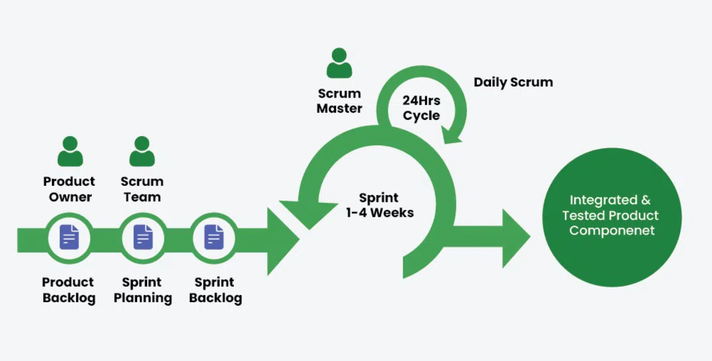

# Agile

---

## 1. Why Agile?

Traditional, waterfall-style development often leads to projects bogged down by lengthy planning phases and rigid deadlines. Agile throws this out the window, focusing on iterative development and continuous feedback.

## 2. The Agile Workflow

### 2.1 User Stories & Backlog

The project begins with defining user stories – descriptions of features from the user's perspective. These stories are then prioritized and placed in a backlog, a list of tasks to be completed.

### 2.2 Sprints & Planning

The work is divided into short, time-boxed periods called sprints (usually 1-4 weeks). At the beginning of each sprint, the team selects a set of user stories from the backlog to focus on.

### 2.3 Daily Stand-ups

Short, daily meetings (often standing to keep them brief!) ensure everyone is on the same page, highlighting progress, roadblocks, and dependencies.

### 2.4 Development & Testing

The development team works collaboratively to complete the user stories committed to in the sprint. Testing is integrated throughout the process.

### 2.5 Sprint Review & Retrospective

At the end of the sprint, a review meeting showcases the completed work to stakeholders and gathers feedback. A retrospective meeting follows, allowing the team to reflect on the sprint, identify areas for improvement, and adapt for the next iteration.

## 3. Agile Development Methods

Agile development methods are a collection of frameworks and practices that prioritize flexibility, collaboration, and rapid delivery of software. Unlike traditional, waterfall-style development, Agile methodologies break down projects into smaller, more manageable pieces and emphasize continuous learning and adaptation throughout the development process.

### 3.1 Scrum

A framework known for its time-boxed sprints (usually 1-4 weeks) and well-defined roles like the Product Owner, Development Team, and Scrum Master. The Scrum team works collaboratively to complete a set of user stories within each sprint and holds daily stand-up meetings and sprint review/retrospective meetings to ensure progress and identify areas for improvement.

#### 3.1.1 Roles in Scrum

- **The Team**: Consists of developers, testers, architects, and other roles needed to complete the project. Ideally, the team is made up of 6 to 10 people.
- **Product Owner**: Represents the customer. Defines the product features and priorities. Validates the functionality.
- **Scrum Master**: Ensures the team follows Scrum processes and facilitates communication.

#### 3.1.2 User Story

A user story describes the user experience in simple language. For example, “As a user, I want to see the local time when I enter a city name.”

#### 3.1.3 Product Backlog

This is a prioritized list of user stories and requirements, acting as a to-do list for the project. The Product Owner manages this backlog.

#### 3.1.4 Sprints

- **Sprints**: The project is divided into small iterations called sprints, usually lasting 2 to 4 weeks.
- **Sprint Planning Meeting**: At the beginning of each sprint, the team selects items from the product backlog to work on.

#### 3.1.5 Daily Scrum Meetings

A 15-minute daily meeting where team members discuss:

- What they did yesterday
- What they plan to do today
- Any problems they are facing

#### 3.1.6 Sprint Review

At the end of each sprint, the team demonstrates the completed work to the Product Owner and receives feedback.

#### 3.1.7 Sprint Retrospective

The team reflects on the sprint, discussing what went well, what didn’t, and how they can improve in the next sprint.

### 3.2 Kanban

A visual method that uses boards to track the progress of tasks through different stages (e.g., To Do, In Progress, Done). Kanban boards are known for their simplicity and flexibility, allowing teams to visualize their workflow and easily manage work in progress.

### 3.3 Lean Software Development

An approach that focuses on eliminating waste and maximizing value in the development process. Lean principles like just-in-time development and continuous improvement are often incorporated into Agile methodologies.

### 3.4 Extreme Programming (XP)

A set of practices that emphasize close collaboration, continuous testing, and rapid feedback. XP practices include pair programming, test-driven development, and short-release cycles.

### 3.5 Crystal

A family of Agile methodologies that emphasizes lightweight processes and adaptation based on project needs. There are different Crystal methodologies (e.g., Crystal Clear, Crystal Serenity) suited for projects of varying sizes and complexities.

## 4. Choosing the Right Agile Method

### 4.1 Project Size and Complexity

Scrum and Kanban might be well-suited for smaller projects, while XP or a Crystal methodology could be better for larger, more complex projects.

### 4.2 Team Culture and Experience

Some methods, like XP with its emphasis on pair programming, require a more collaborative team environment.

### 4.3 Project Requirements and Level of Uncertainty

If requirements are likely to change frequently, Kanban's flexibility might be a good fit.

## 5. How to Use the Agile Method in Remote Work

### 5.1 Weekly Meetings

Hold a virtual meeting every week to discuss progress, address issues, and plan tasks.

### 5.2 Daily Standups

Have short daily check-in meetings to keep everyone updated and aligned on goals.

### 5.3 Clear Communication

Use tools like Slack or Teams for constant communication and quick updates.

### 5.4 Task Management Tools

Use platforms like Trello, Jira, or Asana to assign, track, and manage tasks.

### 5.5 Regular Feedback

Provide regular feedback and adapt plans based on team input and project needs.
