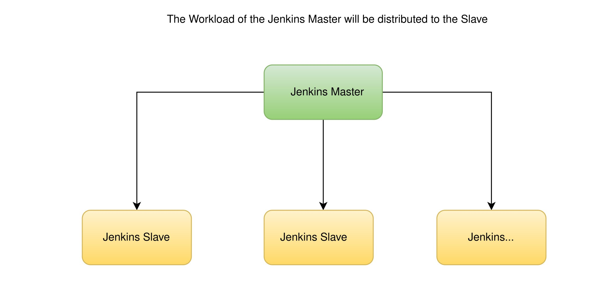
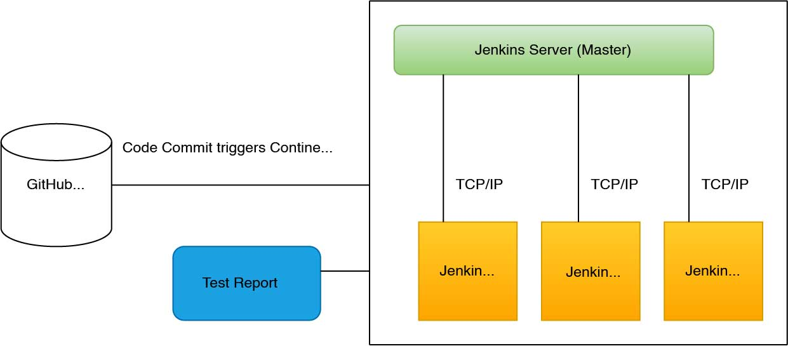

# Jenkins

---

## 1.What is Jenkins

- Jenkins is an open-source automation tool used in DevSecOps to help with continuous integration (CI) and continuous deployment (CD).
- In DevSecOps, Jenkins helps to add security checks into the software development pipeline, automating security tests and compliance checks throughout the development lifecycle.
- It works with any programming language and for multiple platforms including Windows, Linux and macOS.

## 2. Benefits of Jenkins

**Automation:** Jenkins automates the processes of build, testing, and deployment, which reduces manual effort and lowers the chances of errors.
**Fast Issue Detection:** Continuous builds in Jenkins allow for the early detection of bugs, making it possible to resolve issues more quickly.
**Flexibility:** Jenkins supports a wide array of version control systems, programming languages, and testing frameworks. This versatility enhances its adaptability in various development environments.
**Active Community and Extensibility:** With a robust community and over 1500 plugins available, Jenkins is continuously evolving. This support ensures that new integrations and functionalities are regularly added to meet diverse needs in development.

## 3. Jenkins Job types

- **Freestyle:** This is the most basic and common job type in Jenkins. It allows users to configure various options and settings for their build, test, and deploy processes.
- **Pipeline:** This job type allows users to define their build, test, and deploy processes as code using Jenkins' pipeline DSL (domain-specific language).
- **Multi-configuration:** This job type allows users to run the same build with different configurations.
- **External Job:** This job type allows users to run jobs outside of Jenkins, such as a script on a remote machine.
- **Folder:** This job type allows users to organize other Jenkins jobs into a single folder, making it easier to manage and maintain large numbers of jobs.
- **Github organization:** This job type allows users to automatically build and test pull requests and branches from a Github organization.
- **Jenkinsfile:** This job type allows users to define and execute their Jenkins pipeline in a Jenkinsfile.

## 4. Architecture of Jenkins

To address specific needs that a single Jenkins server cannot fulfill, Jenkins employs a distributed architecture. This approach supports multiple testing environments and manages heavy project workloads effectively.

### 4.1 Jenkins Master

The Jenkins master oversees job scheduling, assigns tasks to slaves, and manages build execution. It monitors the status of slaves, collects build results, and displays them in the console output.

### 4.2 Jenkins Slave

Operating on remote servers, Jenkins slaves execute tasks delegated by the master. They support various operating systems and can be specified for particular project requirements.



## 5. Jenkins Workflow

- Jenkins will check the GIT repository for any changes in the source code at regular intervals.
- Each Jenkins build requires its own testing environment, which can’t be created on a single server.
- Jenkins accomplishes this by employing various slaves as needed
- Jenkins Master will communicate the request for testing to these slaves, as well as test reports



Certainly! Jenkins Pipeline is a suite of plugins that supports implementing and integrating continuous delivery pipelines into Jenkins. It provides a way to define complex workflows using a domain-specific language (DSL) based on Groovy. There are two primary ways to define Jenkins Pipeline:

## 6. Jenkins Pipeline Script

This is a script written directly in the Jenkins UI or specified in the "Pipeline script" field of a Jenkins job configuration.

```groovy
pipeline {
    agent any

    stages {
        stage('Build') {
            steps {
                // Example build step
                sh 'echo "Building..."'
            }
        }
        stage('Test') {
            steps {
                // Example test step
                sh 'echo "Testing..."'
            }
        }
        stage('Deploy') {
            steps {
                // Example deployment step
                sh 'echo "Deploying..."'
            }
        }
    }
}
```

In this script:

- `pipeline` defines the entire Jenkins Pipeline.
- `agent any` specifies that the pipeline can execute on any available agent.
- `stages` block contains individual stages (`Build`, `Test`, `Deploy`) of the pipeline.
- Each `stage` contains `steps` that define the actions to be performed in that stage, such as shell commands (`sh`).

## 7. Jenkinsfile

A Jenkinsfile is a text file checked into source control alongside your application code. It defines the Jenkins Pipeline in code and allows for versioning, collaboration, and easier management compared to scripts embedded in Jenkins.

```groovy
node {
    stage('Build') {
        sh 'mvn -B -DskipTests clean package'
    }
    stage('Test') {
        sh 'mvn test'
    }
    stage('Deploy') {
        sh './deploy.sh'
    }
}
```

## 8. fetch the code from GitHub

```groovy
pipeline {
  agent any
  stages {
    stage('Fetch') {
      steps {
        git url: 'https://github.com/user/repo.git'
      }
    }
    stage('Build') {
      steps {
        // Build steps go here
      }
    }
  }
}
```

## 9. Example of adding SonarQube to Jenkins

### a. Install the SonarQube Plugin

1. In Jenkins, go to "Manage Jenkins" > "Manage Plugins".
2. In the "Available" tab, search for "SonarQube Plugin" and select it.
3. Click on the "Install" button.
4. Restart Jenkins after the installation is complete.

### b. Configure the SonarQube Server

1. In Jenkins, go to "Manage Jenkins" > "Configure System".
2. Scroll down to the "SonarQube servers" section.
3. Click on the "Add SonarQube" button.
4. Enter the URL of your SonarQube server and a name for the server.
5. Click on the "Test Connection" button to make sure Jenkins can connect to the SonarQube server.
6. If the connection is successful, click on the "Save" button to save the configuration.

### c. Analyze Your Code

1. In your Jenkins project, go to "Configure" > "Build" > "Add build step" > "Execute SonarQube Scanner".
2. Select the SonarQube server that you configured in step b.
3. Enter the required analysis properties.
4. Click on the "Save" button to save the configuration.
