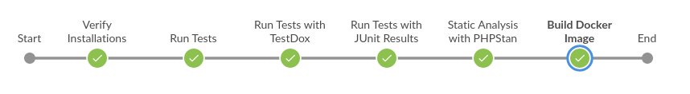

# Pipeline Setup for PHP Projects with Jenkins and Docker



--- 

## 1. Install PHP

```bash
sudo apt install php libapache2-mod-php
sudo apt install php-mysql
php --version
```

## 2. Install PHPUnit (unit tests)

```bash
sudo apt install phpunit
phpunit --version
```

Learn more about PHPUnit:
- [PHPUnit Video Tutorial](https://www.youtube.com/watch?v=a5ZKCFINUkU)
- [Run a PHP File in Jenkins](https://www.youtube.com/watch?v=jAi3xriifEY&t=4s)
- [Run PHPUnit Tests in Jenkins](https://www.youtube.com/watch?v=YChvtJXm514)

## 3. Install PHPStan (static analysis tests)

```bash
wget -O phpstan.phar https://github.com/phpstan/phpstan/raw/HEAD/phpstan.phar
chmod a+x phpstan.phar
sudo mv phpstan.phar /usr/local/bin/phpstan
phpstan --version
```

Learn more about PHPStan:
- [PHPStan Video Tutorial](https://www.youtube.com/watch?v=OiS2xGVWEa0&t=601s)

## 4. Install Docker

Follow steps on this [website](https://docs.docker.com/engine/install/ubuntu/#install-using-the-repository).

## 5. Add the Jenkins User to the Docker Group

This is a common approach to grant Docker access to Jenkins.

```bash
sudo usermod -aG docker jenkins
sudo systemctl restart jenkins
```

## 6. Install Smee

First, install npm from [Node.js](https://nodejs.org/en/download/package-manager).

### Install Smee

```bash
npm install --global smee-client
```

### Configure Smee

```bash
smee --url https://smee.io/PRJF9sQneL2F91T --target http://localhost:8080/github-webhook/
```

Learn more about Smee:
- [Smee Video Tutorial](https://www.youtube.com/watch?v=ULe7c-2aPYY&t=459s)

## 7. Create a Webhook in a GitHub Repository

Create a webhook in a GitHub repository.

## 8. Create a Multibranch Pipeline Job

Create a Multibranch Pipeline job.

## 9. GitHub Repository

This repository contains the Dockerfile, the Jenkinsfile script, and a simple PHP code just for the lab.

- [jenkins-example-php](https://github.com/OussamaSlimani/jenkins-example-php)

