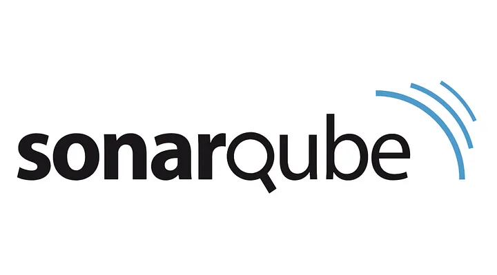
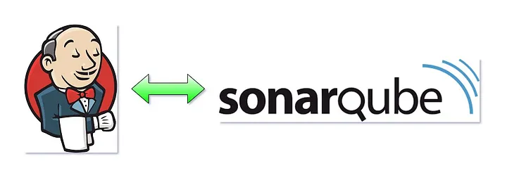

# SonarQube

---



## 1. What is SonarQube?

- SonarQube is a powerful tool for enhancing code quality in software development.
- It is an open-source platform developed by SonarSource to continuously inspect code quality.
- Acting as a code inspector, it analyzes code to detect errors, bugs, issues, duplication, and security vulnerabilities.
- SonarQube supports 30 major programming languages with various plugins.

## 2. Types of Issues

- **Bug**: A small mistake or problem in the code that can lead to unexpected behavior or crashes.
- **Vulnerability**: A weakness or flaw in the code that could be exploited.
- **Code smells**: Characteristics of code that may indicate potential future problems.
- **Code duplication**: Repeating the same or very similar pieces of code across different parts of the program.
- **Security hotspots**: Security-sensitive areas of code that require manual review.
- **Code Coverage**: A measure of how much of your code is tested by automated tests, represented as a percentage.

## 3. Installation (Docker)

```bash
docker pull sonarqube
```

```bash
docker pull postgres:alpine
```

## 4. Running SonarQube (Docker)

```bash
docker run -d --name sonarqube-db -e POSTGRES_USER=sonar -e POSTGRES_PASSWORD=sonar -e POSTGRES_DB=sonarqube postgres:alpine
```

```bash
docker run -d --name sonarqube -p 9000:9000 --link sonarqube-db:db -e SONAR_JDBC_URL=jdbc:postgresql://db:5432/sonarqube -e SONAR_JDBC_USERNAME=sonar -e SONAR_JDBC_PASSWORD=sonar sonarqube
```

This command sets up the SonarQube container linked to a PostgreSQL database.

- Video Tutorial: [How To Sonarqube Setup From Scratch And Code Analysis (2024)](https://www.youtube.com/watch?v=6vdRvz_LnbQ&t=958s)

## 5. Integrating SonarQube and Jenkins



- Log in to SonarQube to create an access token.
- Install the SonarQube Scanner plugin.
- Configure SonarQube Scanner installation details in Jenkins.
- Create credentials to connect Jenkins with SonarQube server.
- Enable "Injecting Environment variables" and specify SonarQube Server details.
- Configure Sonar server tools in Jenkins.
- Jenkinsfile script example:

```groovy
stage('SonarQube Analysis') {
    steps {
        script {
            def scannerHome = tool 'SonarQube Scanner 6.0.0.4432'
            withSonarQubeEnv('sonarqube') {
                sh """
                ${scannerHome}/bin/sonar-scanner \
                    -Dsonar.projectKey=jenkins \
                    -Dsonar.sources=src \
                    -Dsonar.host.url=http://localhost:9000 \
                    -Dsonar.token=sqp_5765aa511ca0b220ecdf5429a634a5357de2510f
                """
            }
        }
    }
}
```

## 6. Adding a Webhook in Jenkins Using Ngrok

### 6.1. Installing Ngrok

- Download the executable.
- Extract Ngrok:

```bash
sudo tar -xvzf ~/Downloads/ngrok-v3-stable-linux-amd64.tgz -C /usr/local/bin
```

- Add your authtoken:

```bash
ngrok config add-authtoken 2iPDHJitAGokTrRwSmFnfKSxKIQ_28F6nhX21EUq1Pj4HVpzK
```

- For detailed instructions, visit the Ngrok [installation documentation](https://dashboard.ngrok.com/get-started/setup/linux).

### 6.2. Deploying Jenkins Online

```bash
ngrok http http://localhost:8080
```

- This command will provide you with a link to access Jenkins.

- Video Tutorial: [How to Forward Webhooks to Jenkins Behind a Firewall using Ngrok](https://www.youtube.com/watch?v=yMNJeWeE0qI&t=466s)

### 6.3. Configuring SonarQube

- Navigate to SonarQube and add the Ngrok webhook link under the webhook section: `link_of_ngrok/sonarqube-webhook/`.

### 6.4. Jenkinsfile Example

```groovy
stage("Quality Gate") {
    steps {
        script {
            try {
                waitForQualityGate abortPipeline: true
            } catch (err) {
                echo "Quality Gate check failed: ${err}"
            }
        }
    }
}
```

- Video Tutorial: [How to Integrate SonarQube With Jenkins](https://www.youtube.com/watch?v=KsTMy0920go&t=257s)
