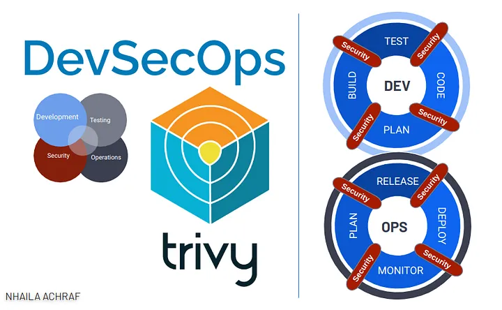

# Trivy

---



## 1. Introduction

Trivy is a comprehensive vulnerability scanner for containers and other artifacts, designed to provide security scanning during development phases. It helps in identifying vulnerabilities in container images and filesystems.

## 2. Installation

### 2.1. Download Trivy

Use `wget` to download the Trivy Debian package from the official GitHub releases page.

```bash
wget https://github.com/aquasecurity/trivy/releases/download/v0.53.0/trivy_0.53.0_Linux-64bit.deb
```

### 2.2. Install Trivy

Install the downloaded `.deb` package using `dpkg`.

```bash
sudo dpkg -i trivy_0.53.0_Linux-64bit.deb
```

## 3. Usage

### 3.1. Scan an Image

To scan a container image named `IMAGE_NAME` for critical and high-severity vulnerabilities:

```bash
trivy image IMAGE_NAME
```

### 3.2. Scan an Image with Defined Severity

Scan a container image named `IMAGE_NAME` for vulnerabilities with specific severities.

```bash
trivy image --severity CRITICAL,HIGH IMAGE_NAME
```

### 3.3. Scan an Image with No Progress Output

Scan an image and suppress progress output:

```bash
trivy image --severity CRITICAL,HIGH --no-progress IMAGE_NAME
```

## 4. Trivy with Jenkins Pipeline

```groovy
stage('Test Security Vulnerabilities with Trivy') {
    steps {
        script {
            def imageName = 'flare-bank:12'
            sh "trivy image --severity CRITICAL ${imageName}"
        }
    }
}
```

## 5. Resources

- Official Trivy Documentation: [website](https://aquasecurity.github.io/trivy/v0.53/)
- YouTube Tutorial: [Getting Started With Trivy and Jenkins](https://www.youtube.com/watch?v=MWe01VdwuMA)
