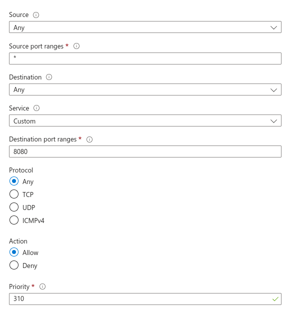

# Configuration VM

---

## 1. Create virtual machine

1. Create vm

- Portal Azure website: [website](https://portal.azure.com/)
- YouTube Tutorial: [Setup an Azure Virtual Machine in JUST 5 minutes - Tutorial](https://www.youtube.com/watch?v=OCiN37sjXuw)

2. Change network security group configuration to allow port 8080 and 9000

- YouTube Tutorial: [Setup an Azure Virtual Machine in JUST 5 minutes - Tutorial](https://www.youtube.com/watch?v=w8H5fWBHddA)



3. open your vm with ssh from ububtu terminal
   ```bash
   ssh -i path/to/vm_key.pem <vm_name>@<cm_ip_adress>
   ```

## 2. Java 17

1. Open a root shell:

   ```bash
   sudo bash
   ```

2. Install necessary packages:

   ```bash
   apt install -y wget apt-transport-https
   mkdir -p /etc/apt/keyrings
   ```

3. Add the AdoptOpenJDK GPG key:

   ```bash
   wget -O - https://packages.adoptium.net/artifactory/api/gpg/key/public | tee /etc/apt/keyrings/adoptium.asc
   ```

4. Add the AdoptOpenJDK repository:

   ```bash
   echo "deb [signed-by=/etc/apt/keyrings/adoptium.asc] https://packages.adoptium.net/artifactory/deb $(awk -F= '/^VERSION_CODENAME/{print$2}' /etc/os-release) main" | tee /etc/apt/sources.list.d/adoptium.list
   ```

5. Install Java 17:

   ```bash
   apt update
   apt install temurin-17-jdk
   ```

7. Exit the root shell:

   ```bash
   exit
   ```

## 3. Jenkins

1. Add Jenkins APT Repository

   ```bash
   sudo wget -O /usr/share/keyrings/jenkins-keyring.asc \
   https://pkg.jenkins.io/debian-stable/jenkins.io-2023.key
   ```

   ```bash
   echo "deb [signed-by=/usr/share/keyrings/jenkins-keyring.asc]" \
   https://pkg.jenkins.io/debian-stable binary/ | sudo tee \
   /etc/apt/sources.list.d/jenkins.list > /dev/null
   ```

2. Install Jenkins on Ubuntu 24.04

   ```bash
   sudo apt update
   sudo apt install jenkins -y
   ```

   ```bash
   systemctl status jenkins
   ```

   If by any chance Jenkins is not running, execute the following command to start it.

   ```bash
   sudo systemctl start jenkins
   ```

3. Configure Firewall Rules for Jenkins

   ```bash
   sudo ufw enable
   ```

   ```bash
   sudo ufw allow 8080
   ```

   ```bash
   sudo ufw reload
   ```

   ```bash
   sudo ufw status
   ```

4. Browse jenkins server’s address

   ```
   http://<vm-ip-adress>:8080
   ```

5. Get the password
   ```bash
   sudo cat /var/lib/jenkins/secrets/initialAdminPassword
   ```

## 4. SonarQube

### 4.1. Install PostgreSQL

1. Update and upgrade your system:

   ```bash
   sudo apt update
   sudo apt upgrade
   ```

2. Add the PostgreSQL repository:

   ```bash
   sudo sh -c 'echo "deb http://apt.postgresql.org/pub/repos/apt $(lsb_release -cs)-pgdg main" > /etc/apt/sources.list.d/pgdg.list'
   ```

3. Import the repository signing key:

   ```bash
   wget -qO- https://www.postgresql.org/media/keys/ACCC4CF8.asc | sudo tee /etc/apt/trusted.gpg.d/pgdg.asc &>/dev/null
   ```

4. Install PostgreSQL:
   ```bash
   sudo apt update
   sudo apt-get -y install postgresql postgresql-contrib
   sudo systemctl enable postgresql
   ```
5. Set the password for the `postgres` user:

   ```bash
   sudo passwd postgres
   ```

6. Switch to the `postgres` user:

   ```bash
   su - postgres
   ```

7. Create a new user for SonarQube:

   ```bash
   createuser sonar
   ```

8. Open PostgreSQL command line:

   ```bash
   psql
   ```

9. Run the following commands to set up the database and user:

   ```bash
   ALTER USER sonar WITH ENCRYPTED PASSWORD 'sonar';
   CREATE DATABASE sonarqube OWNER sonar;
   GRANT ALL PRIVILEGES ON DATABASE sonarqube TO sonar;
   ```

10. Exit PostgreSQL:

    ```bash
    \q
    ```

11. Exit the `postgres` user:
    ```bash
    exit
    ```

### 4.2. Increase Limits

1. Edit the limits configuration file:

   ```bash
   sudo nano /etc/security/limits.conf
   ```

2. Add the following lines at the end of the file:

   ```bash
   sonarqube   -   nofile   65536
   sonarqube   -   nproc    4096
   ```

3. Edit the sysctl configuration file:

   ```bash
   sudo nano /etc/sysctl.conf
   ```

4. Add the following line at the end of the file:

   ```
   vm.max_map_count = 262144
   ```

5. Reboot the system to apply the changes:

   ```bash
   sudo reboot
   ```

### 4.3. Install SonarQube

1. Download SonarQube:

   ```bash
   sudo wget https://binaries.sonarsource.com/Distribution/sonarqube/sonarqube-10.6.0.92116.zip
   ```

2. Install unzip and extract SonarQube:

   ```bash
   sudo apt install unzip
   sudo unzip sonarqube-10.6.0.92116.zip -d /opt
   sudo mv /opt/sonarqube-10.6.0.92116 /opt/sonarqube
   ```

3. Create a SonarQube user and set permissions:

   ```bash
   sudo groupadd sonar
   sudo useradd -c $USER -d /opt/sonarqube -g sonar sonar
   sudo chown sonar:sonar /opt/sonarqube -R
   ```

4. Update SonarQube properties with database credentials:

   ```bash
   sudo nano /opt/sonarqube/conf/sonar.properties
   ```

5. Find and update the following values:

   ```

   sonar.jdbc.username=sonar
   sonar.jdbc.password=sonar
   sonar.jdbc.url=jdbc:postgresql://localhost:5432/sonarqube
   ```

6. Create a systemd service for SonarQube:

   ```bash
   sudo nano /etc/systemd/system/sonar.service
   ```

7. Add the following configuration:

   ```
   [Unit]
   Description=SonarQube service
   After=syslog.target network.target

   [Service]
   Type=forking

   ExecStart=/opt/sonarqube/bin/linux-x86-64/sonar.sh start
   ExecStop=/opt/sonarqube/bin/linux-x86-64/sonar.sh stop

   User=sonar
   Group=sonar
   Restart=always

   LimitNOFILE=65536
   LimitNPROC=4096

   [Install]
   WantedBy=multi-user.target
   ```

8. Start and enable the SonarQube service:
   ```bash
   sudo systemctl start sonar
   sudo systemctl enable sonar
   sudo systemctl status sonar
   sudo tail -f /opt/sonarqube/logs/sonar.log
   ```

### 4.4. Access the SonarQube UI

Open a web browser and go to:

```
http://<vm-ip-adress>:9000
```
